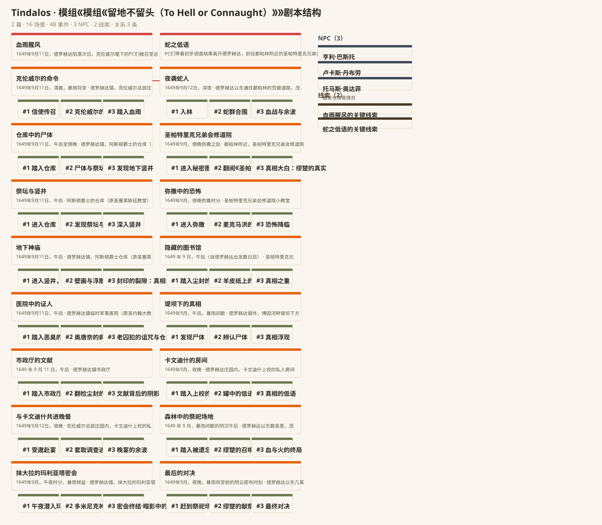

# Tindalos

克苏鲁 TRPG 备团系统：**KP 主控 → 自适应 NPC 并行生成 → 分幕剧本 → 备团笔记 → 剧本节点图交互编辑**；内置 **eval + 自进化闭环**。

[](https://github.com/SgtBaixiao/tindalos/actions/workflows/ci.yml)
[](https://sgtbaixiao.github.io/tindalos/)


**▶ 在线演示**：[sgtbaixiao.github.io/tindalos](https://sgtbaixiao.github.io/tindalos)（剧本节点图 · 点击节点 → 抽屉编辑 · 生成进度带 · 暖墨深色板）

```
KP 主控 ──► 解析模组 → 拟定幕结构 ──► NPC 并行注入人格（Send）──► 每幕子图写作 ──► 校对付印
              │  ▲                                    │
              │  └─ kg_query 工具（Function Calling）  │
              └─────────────────────────────────────────┘
                                        │
                          campaign.json（剧本）+ notes.md（备团笔记）+ memory.sqlite（跨会话记忆）
                                        │
                          React Flow 剧本节点图（前端 · SSE 实时进度流 · 局部重生成）
```



## 技术栈

| 层 | 选型 | 为什么 |
|---|---|---|
| 多智能体编排 | **LangGraph**（StateGraph + Send/@task + SqliteSaver checkpoint + Store） | supervisor 官方弃维护；确定性编排 + 并行扇出更贴 KP→NPC 拓扑 |
| 世界知识图谱 | **NetworkX**（六类语义边 + 时间窗 + 多跳） | Kuzu 已弃维护；数百节点不需要图数据库（工程判断力） |
| 领域模型 | **Pydantic v2**（Campaign→Act→Scene→Event + NPC/Clue/关系，extra=forbid） | 跨层引用校验 + schema 漂移可检出 |
| eval + 自进化 | 4 维 rubric + 确定性检查 + LLM-judge 降级 + 归因四类 + evolve 循环 | 分数可复现、修复白名单、收敛幂等（3.2→5.0） |
| 前端 | React 19 + Vite + @xyflow/react v12 + dagre + zustand | 唯一开箱即交互编辑 + 深度可定制 + React 原生 |
| API | stdlib http.server SSE（零依赖） | `tindalos serve` 实时进度流 + 局部重生成 |
| 质量 | Docker 加固沙箱 + G0–G7 门管线 + 双轴评审 | 234 后端 + 74 前端测试全绿，零网络零 LLM 可复现 |

## 云端 API 模式（推荐 · 非本地模型）

用任一**国产云端大模型 API** 驱动生成（DeepSeek 主选；Kimi/GLM/Qwen/SiliconFlow 均可——OpenAI 兼容端点）：

```bash
# 环境变量（三件套）
export TINDALOS_API_KEY=sk-...                    # DeepSeek 等云端 key
export TINDALOS_API_BASE=https://api.deepseek.com/v1   # 任意 OpenAI 兼容端点
export TINDALOS_MODEL=deepseek-chat                # kimi-k3 / glm-4-plus / qwen-plus ...

# 一键本地全流程（PDF/模组 → 结构化 → 生成 → eval → evolve → 记忆）
bash scripts/run-module.sh "留地不留头.pdf" data/output
```

> **本地运行原则**：所有 LLM/API 工作流在本机执行（`bash scripts/run-module.sh`）；GitHub Actions 仅跑**纯离线**确定性回归（pytest/vitest/smoke，零 API 零网络）——不依赖任何云端工作流。

**选型表**（Tindalos 客户端 = OpenAI 兼容 `/chat/completions`，换端点即换模型）：

| 提供商 | base_url | 模型 | 说明 |
|---|---|---|---|
| **DeepSeek**（实测 ✅） | `https://api.deepseek.com/v1` | `deepseek-chat` / `deepseek-reasoner` | 国产、性价比高、结构化输出稳——**当前默认** |
| Moonshot Kimi | `https://api.moonshot.cn/v1` | `kimi-k3`（524K 上下文） | 求职目标公司；超大上下文 |
| 智谱 GLM | `https://open.bigmodel.cn/api/paas/v4` | `glm-4-plus` | 国产老牌 |
| 通义 Qwen | `https://dashscope.aliyuncs.com/compatible-mode/v1` | `qwen-plus` / `qwen-max` | 阿里 |
| SiliconFlow | `https://api.siliconflow.cn/v1` | `deepseek-ai/DeepSeek-V3` 等 | 聚合平台 |

**模组全文注入**（loop 迭代改进）：LLM 生成时自动把模组正文（截断至 `TINDALOS_LLM_CONTEXT`，默认 16000 字符）作为背景注入 prompt——剧本真正基于模组内容（幕名/地点/NPC/事件都取自模组），而非只依赖首段前提。

## 快速开始

```bash
pip install -e ".[dev,llm]"

# ① 生成剧本（离线确定性，零 LLM）
tindalos generate examples/sample-module.md --out campaign.json
# ② 备团笔记（含「记忆」节，KP 跨会话续备团）
tindalos notes campaign.json --out notes.md
# ③ 评估（4 维分数 + 失败源归因）
tindalos eval campaign.json
# ④ 自进化（eval → 确定性修复 → 复评；坏剧本 3.2→5.0）
tindalos evolve examples/campaign-broken.json --rounds 3 --out evolved.json
# ⑤ 知识图谱查询（实体关系 / 多跳线索推理）
tindalos kg campaign.json --entity npc-1 --path-to clue-act-1
# ⑥ 实时服务（SSE 进度流 + 局部重生成 API）
tindalos serve --port 8347
# ⑦ 跨会话记忆
tindalos memories campaign.json

# 前端（实时演示）
cd frontend && npm ci && npm run dev
# 前端实时模式（连 serve：?live=1 时进度流 + 重生成按钮可用）
```

测试：`python -m pytest tests/ -q`（234 后端，无网络沙箱）· `cd frontend && npx vitest run`（74 前端）· CI 见 `.github/workflows/`。

## 实验结果（真实模组《留地不留头》To Hell or Connaught）

用 1649 爱尔兰克苏鲁模组 PDF（20 页 / 23.6K 字符）跑全流程的对比：

| 生成器 | 幕 | 场景 | 事件 | 确定性 eval | LLM judge | 内容质量 |
|---|---|---|---|---|---|---|
| Deterministic（离线模板） | 2 | 4 | 12 | 5.0 | — | 模板化（第I幕·初现端倪），不含模组内容 |
| 本地 qwen2.5:3b | 2 | 4 | 12 | 4.5 | — | 部分真实（NPC 名），scene 级频繁降级 |
| **云端 DeepSeek-chat + 全文注入** | 2 | **16** | **48** | **5.0** | **4.5**（playability 4） | **真实模组内容**（德罗赫达陷落史实、蛇人德鲁伊缪楚、旧印、NPC 背景全来自模组） |

- **LLM judge**（DeepSeek 当裁判）对 48 事件剧本给 playability 4——比确定性规则更严格，正是三层 verifier 的意义（确定性 > LLM-judge > 人工）。
- **数据管道**：`PDF → PyMuPDF 提取 → DeepSeek 结构化整理（organize_module.py）→ 生成`——模组原始叙述归位为 元信息/背景/时间线/地点(10)/NPC/事件链/线索/检定清单。
- 全部在**本地**运行（bash scripts/run-module.sh），不依赖 GitHub 工作流。

## 开发

```bash
# 测试（沙箱内执行，零网络零 LLM）
python -m pytest tests/ -q

# src 布局免安装 import（沙箱只读无网络，无法 pip install -e）
python -c "import sys; sys.path.insert(0, 'src'); import tindalos; print(tindalos.__version__)"
```

> pytest 通过 `tests/conftest.py` 自动把 `src/` 加入 `sys.path`（src 布局，免安装）；`python -c` 不加载 conftest，需显式 `PYTHONPATH=src`。

## Usage

CLI 入口为 `tindalos`（Typer，`src/tindalos/cli.py`，经 `[project.scripts]` 暴露）。安装后直接使用；未安装时可用 `PYTHONPATH=src python -c "from tindalos.cli import app; app()" <args>` 等价调用。五命令示例：

```bash
# ① 生成 campaign：模组文本（.md 或含 premise/title 的 .json）→ 分幕剧本 + 同目录 notes.md 备团笔记
#    默认 DeterministicGenerator；--llm 且 TINDALOS_LLM_ENABLED=1 时改用 OllamaGenerator
PYTHONPATH=src python -c "from tindalos.cli import app; app()" generate module.md --out campaign.json
PYTHONPATH=src python -c "from tindalos.cli import app; app()" generate module.json --out campaign.json --llm

# ② 重生成备团笔记（campaign JSON → notes.md）
tindalos notes campaign.json --out notes.md

# ③ 评测：4 维分数表 + 归因 + 建议；JSON 到 stdout（无 --out）或 --out 文件
#    --judge 启用 LLM 裁判（需 TINDALOS_LLM_ENABLED=1，否则降级 judge=none）
tindalos eval campaign.json
tindalos eval campaign.json --judge --out eval.json

# ④ 自进化：eval → 确定性修复 → 复评，循环 rounds 轮（打印 loop_log）
tindalos evolve campaign.json --rounds 2 --out campaign.evolved.json

# ⑤ 世界知识图谱查询：实体关系 / 多跳路径
#    成功退出码 0；输入缺失 / 实体未知 → 非 0 退出码
tindalos kg campaign.json --entity npc-1
tindalos kg campaign.json --entity npc-1 --path-to clue-act-1
```

## LLM 模式（可选）

默认全程离线确定性（零网络零 LLM）；开启后 `generate --llm` 改用 Ollama（OpenAI 兼容
`/chat/completions`）生成幕/NPC/场景草案，`eval --judge` 启用 LLM 裁判。

### 开启方式（环境变量）

```bash
# Git Bash / Linux
export TINDALOS_LLM_ENABLED=1
export TINDALOS_MODEL=qwen2.5:0.5b   # 模型名（默认 deepseek-r1，按本地 Ollama 实际模型覆盖）
export OLLAMA_BASE_URL=http://localhost:11434/v1 # OpenAI 兼容端点（默认即此）
export TINDALOS_LLM_TIMEOUT=300                  # 单次请求超时秒数（默认 180）
export TINDALOS_LLM_MAX_RETRIES=2                # 网络抖动/5xx/429 重试次数（默认 2）

# Windows cmd.exe（双写法）
# set TINDALOS_LLM_ENABLED=1 && set TINDALOS_MODEL=qwen2.5:0.5b && set PYTHONIOENCODING=utf-8
```

`--llm` 仅在 `TINDALOS_LLM_ENABLED=1` 时生效；未开启时 CLI 向 stderr 告警并回退确定性生成器。

### 用法

```bash
PYTHONPATH=src python -c "from tindalos.cli import app; app()" generate examples/sample-module.md --llm --out campaign-llm.json
PYTHONPATH=src python -c "from tindalos.cli import app; app()" eval campaign-llm.json --judge --out eval-llm.json
```

一键演示（generate → eval → evolve，打印每步产物路径与总分数）：

```bash
bash examples/llm-demo.sh
```

### 降级语义（LLM 失败不阻塞管线）

- LLM 调用失败（连接失败/超时/4xx/5xx 重试耗尽）或回复无法解析（坏 JSON/缺少必要字段）
  → 该次生成回退 `DeterministicGenerator`，并向 stderr 发 `UserWarning`（如
  `OllamaGenerator 生成失败（generate_npcs：无有效 JSON），回退 DeterministicGenerator`）；
- 容错细节：`OllamaGenerator` 剥离 `\`\`\`json / \`\`\`` 围栏（含未闭合围栏）与前后缀说明文字，
  支持顶层数组与工具调用（`tool_calls[].function.arguments`）解析，并对模型输出的
  int id / 非法事件 kind 等做规整；
- 因此即使模型名错误/服务不可用，`generate --llm` 仍成功退出（产出确定性 campaign），
  评测/自进化照常执行——LLM 是可选的“增强层”，不是硬依赖。

## 为什么做这个项目（求职叙事）

克苏鲁 TRPG 备团是垂直场景，但造它的技术动机是通用的：

> **问题**：多智能体 Agent 系统（主控 → 并行子 agent → 分幕产出）怎么设计才能**离线可测、可评估、能自修复**？
> LLM 输出不可靠时如何优雅降级？产出物怎么让人类**可视、可编辑**（而不是一坨文本）？

Tindalos 用一条完整链路回答：LangGraph 多智能体编排（KP 主控 → Send 并行 NPC → 每幕子图）
+ 世界知识图谱（跨会话记忆与线索推理） + 4 维 eval + **自进化闭环**（eval → 确定性修复 → 复评，
坏剧本 3.2→5.0 收敛） + React Flow 剧本节点图（点击抽屉编辑）。

**可直接讲的技术亮点**（面试口头版）：

1. **多智能体拓扑经过实证选型**：对比 supervisor（官方弃维护）后采用自定义 StateGraph 主图 + `@task`/`Send` 并行 + 每幕子图——确定性编排 + 并行扇出，语义与 KP→NPC 的实际工作流同构；sqlite checkpoint 跨进程恢复、Store 跨会话记忆、custom 进度流（前端进度带的数据源）全部本机实测跑通。
2. **离线确定性可测是设计铁律**：`Generator` 协议（Deterministic 离线 / Ollama 可选）——全部 140 个测试零网络零 LLM，在无网络加固沙箱内跑；LLM 失败按设计降级（根因告警带 HTTP 状态码，不吞栈）。
3. **eval 不是脚本，是闭环**：4 维 rubric（结构/一致性/深度/可玩性，1-5 锚点）+ 确定性检查清单（schema 合法/id 唯一/引用可解析/KG 无矛盾…）+ LLM-judge 可选降级 + **失败源归因四类**（structure/data/model/evaluation）；`evolve` 把建议变成确定性修复（注册悬空 NPC/重生成空场景/失效重叠关系/补线索链接），loop_log 记录每轮 applied/delta/evidence，收敛提前终止、幂等。
4. **开发过程本身就是自进化的实证**：本仓库经 harness 门管线构建（G0–G7），双轴评审抓到并修复 6+ 处测试没覆盖的真实缺陷（含默认 checkpointer 崩溃、重叠永久关系窗、事件 id 无限循环、退役模型 410 假成功）——180+ 测试全绿。
5. **国产云端 LLM API 接入**（2026-08-11）：OpenAI 兼容客户端泛化（base_url + Bearer key 一键换端点），实测 DeepSeek deepseek-chat 驱动真实模组《留地不留头》——16 场景 / 48 事件、eval 5.0、LLM judge 4.5（比确定性规则更严格的裁判）；Kimi K3（524K 上下文）已配置可直切。
6. **真实模组数据管道**：PDF → 文本提取 → 云端 LLM 结构化整理（organize_module.py：元信息/背景/时间线/10 地点/NPC/事件链/线索/检定清单）→ 生成；模组全文注入让剧本真正基于模组内容（德罗赫达陷落史实、蛇人德鲁伊缪楚、旧印）。

**面试可追问的答案**（深挖弹药）：

- *为什么不用 supervisor？* 官方已标记弃维护；KP→NPC 是确定流程 + 并行子任务，StateGraph + Send 更贴切，可控可测。
- *为什么知识图谱不上 Neo4j？* 数百节点本地场景 NetworkX + JSON 图足够；图的价值在**可解释多跳推理、时间有效窗（当时为真 vs 现在为真）、实体中心记忆**，不在存储引擎。Kuzu 已弃维护，graphiti/cognee 是业界参照（LongMemEval +18.5%）。
- *eval 的分数可信吗？* 确定性检查可复现；LLM-judge 双模型取 min 保守聚合（dualJudge）；归因先查评测的锅（CORE-bench 42%→95% 案例），再谈模型。
- *自进化会不会越修越坏？* 确定性修复白名单 + 收敛提前终止 + 幂等（同输入两次运行结果一致）+ rounds 上限；LLM 建议只记 pending 不自动应用（人审待定）。

**一键演示路径**：

```bash
bash examples/llm-demo.sh                      # LLM 模式全链路（generate→eval→evolve）
PYTHONPATH=src python -m tindalos.cli generate examples/sample-module.md --out examples/campaign.json
PYTHONPATH=src python -m tindalos.cli eval examples/campaign.json
PYTHONPATH=src python -m tindalos.cli evolve examples/campaign-broken.json --rounds 3 --out /tmp/evolved.json  # 坏剧本 3.2→5.0
cd frontend && npm run dev                     # 剧本节点图（点击节点 → 抽屉编辑）
```

仓库其他材料：领域词汇表 `CONTEXT.md`、模块架构设计 `docs/architecture.md`（面试可深讲）、
前端设计系统继承 house-style（暖色极简 + 暖墨深色板，见 `frontend/src/theme.css`）。
